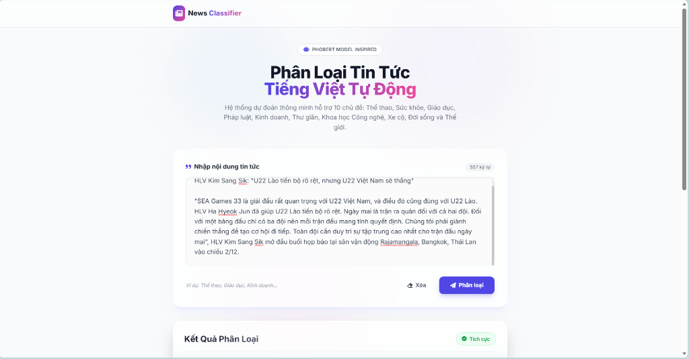
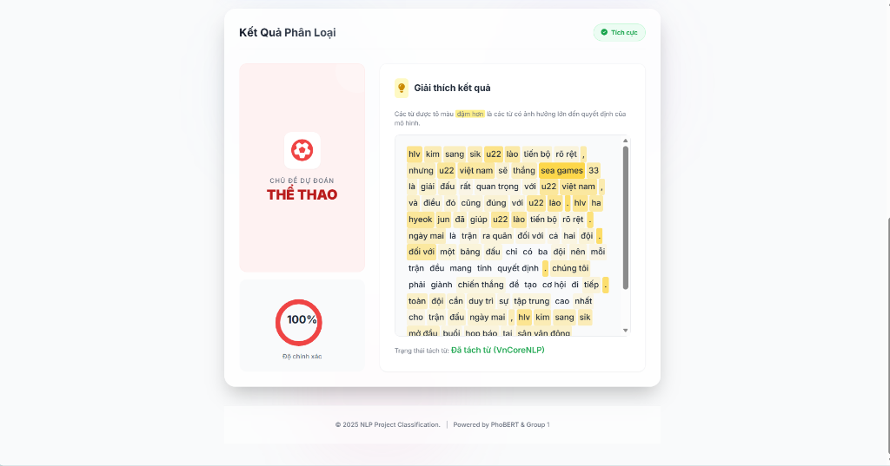

# Phân Loại Tin Tức Tiếng Việt với PhoBERT (Vietnamese News Classification)

Dự án này sử dụng mô hình **PhoBERT** (được fine-tune) để phân loại tin tức tiếng Việt vào 10 chủ đề khác nhau. Ứng dụng được xây dựng với giao diện web sử dụng **FastAPI**.


*(Giao diện nhập liệu tin tức)*


*(Kết quả phân loại và giải thích từ khóa)*

## 🚀 Tính Năng

*   **Phân loại văn bản tự động**: Nhập tiêu đề hoặc nội dung tin tức, hệ thống sẽ dự đoán chủ đề.
*   **Giải thích kết quả (Explainability)**: Hiển thị mức độ quan trọng của từng từ trong việc đưa ra quyết định (dựa trên cơ chế Attention của BERT).
*   **Tách từ tiếng Việt (Word Segmentation)**: Tích hợp sẵn **VnCoreNLP** để xử lý ngôn ngữ tiếng Việt chính xác nhất.

## 📂 Cấu Trúc Dự Án

```
NLP Project/
├── Model_PhoBERT/         # Chứa model đã train (PhoBERT fine-tuned)
├── Code/
│   ├── Web_Application/   # Mã nguồn ứng dụng Web
│   │   ├── app.py         # File chính chạy server
│   │   ├── templates/     # Giao diện HTML
│   │   ├── static/        # CSS, JS
│   │   └── vncorenlp/     # Thư viện tách từ (sẽ được cài đặt tự động)
│   └── Setup_and_Debug/   # Script cài đặt
└── requirements.txt       # Danh sách thư viện cần thiết
```

## 🛠️ Cài Đặt & Chạy Ứng Dụng

### Bước 1: Cài đặt môi trường
Yêu cầu Python 3.8 trở lên. Cài đặt các thư viện cần thiết:

```bash
pip install -r requirements.txt
```

### Bước 2: Tải Model & VnCoreNLP
**Quan trọng:** Do giới hạn dung lượng GitHub, bạn cần tải model thủ công:
1.  Tải thư mục `Model_PhoBERT` từ (https://drive.google.com/drive/folders/1qWsYTslZHX7i-avtQO785pdbLAW9niYa?usp=sharing)
2.  Giải nén và đặt vào thư mục gốc của dự án (ngang hàng với thư mục `Code`).

Sau đó, chạy script để tải VnCoreNLP:
```bash
python Code/Setup_and_Debug/install_vncorenlp.py
```
*Script này sẽ tự động tải file JAR và models vào thư mục `Code/Web_Application/vncorenlp`.*

### Bước 3: Khởi chạy Server
Chạy lệnh sau từ thư mục gốc của dự án:

```bash
uvicorn Code.Web_Application.app:app --reload
```
Hoặc nếu bạn đang đứng trong thư mục `Code/Web_Application`:
```bash
uvicorn app:app --reload
```

### Bước 4: Sử Dụng
Mở trình duyệt và truy cập: [http://localhost:8000](http://localhost:8000)

1.  Nhập nội dung tin tức vào ô văn bản.
2.  Nhấn nút **"Phân Loại"**.
3.  Xem kết quả chủ đề và biểu đồ giải thích các từ khóa quan trọng.

## 📊 Các Nhãn Phân Loại (10 Chủ Đề)
0.  Thể thao
1.  Sức khỏe
2.  Giáo dục
3.  Pháp luật
4.  Kinh doanh
5.  Thư giãn
6.  Khoa học công nghệ
7.  Xe cộ
8.  Đời sống
9.  Thế giới

## 📝 Ghi Chú
*   Model PhoBERT cần GPU để chạy nhanh nhất, nhưng vẫn hoạt động tốt trên CPU (thời gian dự đoán khoảng 1-2 giây).
*   Nếu gặp lỗi "Java not found", hãy đảm bảo máy tính đã cài đặt **Java Runtime Environment (JRE)** để chạy VnCoreNLP.
